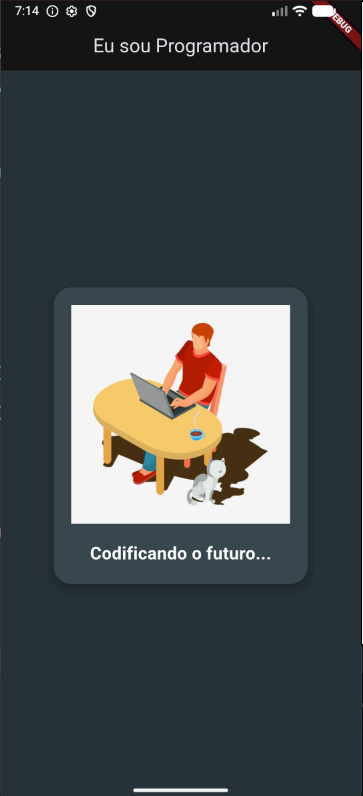

### 🌟 Introdução

* **Nome do projeto:** App Sou Programador 📱
* **Evento ou contexto em que o projeto foi desenvolvido:** Projeto de introdução ao desenvolvimento mobile (descrito no repositório como "Meu primeiro App").
* **Objetivo principal ou desafio do projeto:** Explorar o ecossistema de desenvolvimento mobile, compreender a estrutura de pastas e aprender a construir uma interface gráfica básica utilizando o framework Flutter.
* **Detalhes interessantes ou relevantes:** Este projeto funciona como um rito de passagem (uma espécie de "Hello World" visual). É o primeiro contato prático do desenvolvedor com a linguagem Dart e com o paradigma de construção de telas baseado em Widgets.

---

### 🚀 Principais Funcionalidades do Projeto

Sendo um aplicativo focado na introdução ao framework, suas funcionalidades giram em torno da estruturação visual:

1. **Interface de Exibição:** O aplicativo apresenta uma tela amigável contendo textos e recursos visuais estáticos, focada em transmitir a mensagem de que o usuário é um programador.
2. **Carregamento de Assets:** O app busca e exibe arquivos de mídia armazenados localmente (graças à configuração da pasta `images` no repositório).
3. **Estrutura de Tela Básica:** Utiliza componentes fundamentais para montar o layout, como barras de navegação (AppBar) e o corpo principal da página, garantindo que o conteúdo fique centralizado e bem distribuído na tela do celular.
4. **Base Multiplataforma:** A partir da mesma base de código escrita em Dart, a aplicação já está estruturada para ser compilada tanto para dispositivos Android quanto para iOS.

---

### 🛠️ Tecnologias Utilizadas

* **Flutter:** Framework UI de código aberto criado pelo Google. Foi empregado para construir toda a interface de usuário de forma rápida e expressiva. 🦋
* **Dart:** A linguagem de programação por trás do Flutter. Utilizada para escrever a árvore de componentes visuais (Widget Tree) e qualquer lógica necessária no app. 🎯
* **Kotlin / Android SDK:** Configurações geradas nativamente pelo framework para permitir que o aplicativo seja instalado e executado perfeitamente no sistema operacional Android. 🤖

---

### 📸 Capturas de Tela do Projeto

---

### 📚 Lições Aprendidas

O desenvolvimento deste "primeiro app" é um marco que permite o domínio de habilidades cruciais para o mobile:
* **Configuração de Ambiente:** O desafio de instalar o SDK do Flutter, configurar variáveis de ambiente e rodar o código em um emulador ou smartphone físico pela primeira vez.
* **Compreensão de Widgets:** Entendimento prático de que "tudo no Flutter é um Widget", aprendendo a aninhar elementos (pais e filhos) para formar o design da tela.
* **Configuração do `pubspec.yaml`:** Aprendizado sobre como declarar dependências e registrar caminhos de arquivos estáticos (como imagens e fontes) para que o aplicativo possa utilizá-los sem erros.

---

### 🏁 Conclusão

O **App Sou Programador** pode ser um projeto de escopo inicial, mas carrega uma grande importância por quebrar a primeira barreira do aprendizado mobile. A satisfação de ver o código rodando nativamente na tela de um celular pela primeira vez é enorme. Ele estabelece os alicerces fundamentais do Flutter e do Dart, preparando o terreno para a criação de aplicativos futuros muito mais complexos, dinâmicos e com integração de APIs. ✨
